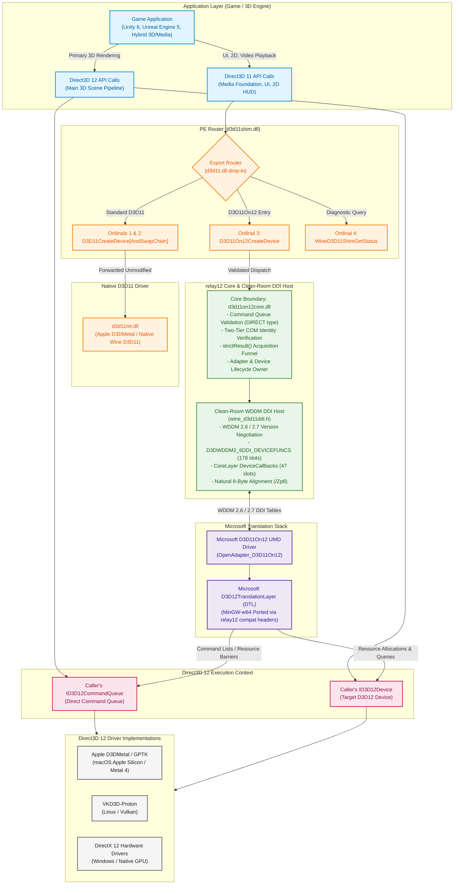

# relay12: Direct3D 11 to 12 Translation Layer & WDDM DDI Host

[](LICENSE)
[](THIRD_PARTY_NOTICES.md)
[](docs/CLEANROOM-DDI.md)
[](docs/D3D11ON12.md)
[](docs/DDI-REMAINING-ROADMAP.md)

`relay12` provides the host environment, validation boundary, and clean-room driver infrastructure required to execute Microsoft's open-source Direct3D 11On12 User-Mode Driver (`D3D11On12`) in Wine-based and compatible graphics environments (including macOS Apple Silicon via Apple D3DMetal/GPTK, Linux via VKD3D-Proton, and native Windows).

---

## Table of Contents

- [Executive Summary & Motivation](#executive-summary--motivation)
- [System Architecture](#system-architecture)
  - [Architecture Flowchart (Mermaid)](#architecture-flowchart-mermaid)
  - [Component Architecture Layout (Text)](#component-architecture-layout-text)
  - [End-to-End Execution Flow](#end-to-end-execution-flow)
- [Core Components](#core-components)
  - [1. PE Router (`d3d11shim.dll`)](#1-pe-router-d3d11shimdll)
  - [2. Core Validation Boundary (`d3d11on12core.dll`)](#2-core-validation-boundary-d3d11on12coredll)
  - [3. Clean-Room WDDM DDI Host (`relay12-d3d11/ddi`)](#3-clean-room-wddm-ddi-host-relay12-d3d11ddi)
  - [4. Microsoft D3D11On12 & DTL Portability](#4-microsoft-d3d11on12--dtl-portability)
- [Architectural Philosophy & Invariants](#architectural-philosophy--invariants)
- [Directory Structure](#directory-structure)
- [Verification & Safety Gates](#verification--safety-gates)
- [Building & Development](#building--development)
- [Implementation Roadmap](#implementation-roadmap)
- [Further Reading](#further-reading)
- [Licensing](#licensing)

---

## Executive Summary & Motivation

### The Hybrid Pipeline Problem

Modern games (built on engines like **Unity 6**, **Unreal Engine 5**, and **Frostbite**) frequently utilize a **hybrid rendering architecture**:
- The primary 3D rendering pipeline uses **Direct3D 12** for low-level GPU control, multi-threaded command recording, and modern ray tracing.
- Secondary subsystems—such as video cutscene playback via Windows Media Foundation (WMF), in-game HUDs, and UI layers (e.g., ImGui, CEGUI)—rely on **Direct3D 11**.

To avoid duplicating graphics contexts and GPU memory overhead, these engines call `D3D11On12CreateDevice`, passing their active `ID3D12Device` and direct `ID3D12CommandQueue`. This allows Direct3D 11 rendering commands to interoperate directly with the Direct3D 12 queue and resources.

### Why Existing Runtimes Fall Short

1. **Apple D3DMetal / GPTK:** Historically, Apple's `d3d11.dll` exported `D3D11On12CreateDevice` as a stub returning `DXGI_ERROR_UNSUPPORTED` (`0x887a0004`), causing games with hybrid rendering pipelines to crash, freeze on video playback, or display black screens.
2. **Wine Core Architecture:** Wine implements Direct3D 11 by forwarding directly to WineD3D (or DXVK). Wine does not provide the Windows Driver Model (WDDM) User-Mode Driver (UMD) host runtime required to host D3D11 user-mode driver DLLs.
3. **Microsoft D3D11On12 Is Not a Full Runtime:** Microsoft open-sourced `D3D11On12` and `D3D12TranslationLayer`, but `D3D11On12` is an internal user-mode driver (`OpenAdapter_D3D11On12`). It requires a host runtime that implements the WDDM Device Driver Interface (DDI) callback tables (`DEVICEFUNCS` and `CORELAYER_DEVICECALLBACKS`).

`relay12` bridges this gap cleanly by implementing the missing WDDM DDI host and routing layer, without copying proprietary Windows Driver Kit (WDK) headers and without requiring intrusive modifications to upstream Wine.

---

## System Architecture

### Architecture Flowchart (Mermaid)

The diagram below illustrates how Direct3D calls flow from the application through `relay12` down to underlying GPU driver backends:



---

### Component Architecture Layout (Text)

For plain-text and terminal inspection, the architecture layout is presented below:

```text
+---------------------------------------------------------------------------------------+
|                                  APPLICATION (GAME)                                   |
|                     (e.g., Unity 6, Unreal Engine 5, Frostbite)                       |
+-------------------------------------------+-------------------------------------------+
                     |                                           |
                     | D3D11 API Calls                           | D3D12 API Calls
                     | (UI, 2D, Media Foundation)                | (Primary 3D Pipeline)
                     v                                           v
+-------------------------------------------+   +---------------------------------------+
|           PE ROUTER (d3d11shim.dll)       |   |                                       |
|  Exports:                                 |   |                                       |
|  - Ordinal 1: D3D11CreateDevice           |   |                                       |
|  - Ordinal 2: D3D11CreateDeviceAndSwap... |   |                                       |
|  - Ordinal 3: D3D11On12CreateDevice       |   |                                       |
|  - Ordinal 4: WineD3D11ShimGetStatus      |   |                                       |
+---------------------+---------------------+   |                                       |
       |              |                         |                                       |
       | [Ord 1 & 2]  | [Ordinal 3]             |                                       |
       | Standard     | D3D11On12               |                                       |
       | Forwarding   | Routing                 |                                       |
       v              v                         |                                       |
+--------------+ +----------------------------+ |                                       |
| NATIVE D3D11 | | CORE BOUNDARY              | |                                       |
| (d3d11mt.dll)| | (d3d11on12core.dll)        | |                                       |
| Apple D3D-   | | - Queue Type Validation    | |                                       |
| Metal D3D11  | | - Two-Tier COM Identity    | |                                       |
| or WineD3D   | | - strictResult() Funnel    | |                                       |
+--------------+ +--------------+-------------+ |                                       |
                                |               |                                       |
                                v               |                                       |
                 +----------------------------+ |                                       |
                 | CLEAN-ROOM WDDM DDI HOST   | |                                       |
                 | (wine_d3d11ddi.h)          | |                                       |
                 | - WDDM 2.6 / 2.7 Negotiator| |                                       |
                 | - DEVICEFUNCS (178 slots)  | |                                       |
                 | - Callbacks (47 slots)     | |                                       |
                 | - Natural Alignment (/Zp8) | |                                       |
                 +--------------+-------------+ |                                       |
                                |               |                                       |
                                | DDI Calls     |                                       |
                                v               |                                       |
                 +----------------------------+ |                                       |
                 | MICROSOFT D3D11ON12 UMD    | |                                       |
                 | (OpenAdapter_D3D11On12)    | |                                       |
                 +--------------+-------------+ |                                       |
                                |               |                                       |
                                v               |                                       |
                 +----------------------------+ |                                       |
                 | D3D12 TRANSLATION LAYER    | |                                       |
                 | (MinGW GCC Ported DTL)     | |                                       |
                 +--------------+-------------+ |                                       |
                                |               |                                       |
                                | D3D12 Work    | Direct D3D12 Calls                    |
                                v               v                                       |
                 +----------------------------------------------------------------------+
                 |               CALLER'S D3D12 DEVICE & COMMAND QUEUE                  |
                 |           (ID3D12Device & ID3D12CommandQueue - Direct Queue)         |
                 +----------------------------------+-----------------------------------+
                                                    |
                                                    v
                 +----------------------------------------------------------------------+
                 |                   DIRECT3D 12 HOST IMPLEMENTATIONS                   |
                 +--------------------------+--------------------+----------------------+
                 | Apple D3DMetal / GPTK    | VKD3D-Proton       | Native Windows       |
                 | (macOS / Metal 4)        | (Linux / Vulkan)   | (Hardware Drivers)   |
                 +--------------------------+--------------------+----------------------+
```

---

### End-to-End Execution Flow

1. **Initialization:** The game creates its Direct3D 12 device and direct command queue via standard Direct3D 12 APIs.
2. **On12 Invocation:** The game invokes `D3D11On12CreateDevice(pDevice, flags, ..., pCommandQueues, numQueues, ..., ppDevice, ppImmediateContext)`.
3. **PE Routing:** `d3d11shim.dll` intercepts the call, zero-initializes all caller output pointers, verifies `d3d11on12core.dll` availability, and forwards the arguments.
4. **Validation & Identity Check:** `d3d11on12core.dll` confirms the command queue description is `D3D12_COMMAND_LIST_TYPE_DIRECT`, performs two-tier COM identity verification, and funnels interface queries through `strictResult()`.
5. **DDI Adapter Negotiation:** The core initializes the Clean-Room WDDM DDI Host, negotiating WDDM 2.6 / 2.7 contracts and populating the 47-slot core layer callback table (`D3DWDDM2_6DDI_CORELAYER_DEVICECALLBACKS`).
6. **UMD Activation:** `OpenAdapter_D3D11On12` is called in Microsoft's D3D11On12 driver, receiving driver function tables (`D3DWDDM2_6DDI_DEVICEFUNCS`).
7. **Command Recording & Submission:** D3D11 operations (e.g., video frame blits, UI draw calls) are recorded through Microsoft's `D3D12TranslationLayer` directly into command lists dispatched to the application's supplied Direct3D 12 command queue.

---

## Core Components

### 1. PE Router (`relay12-d3d11/d3d11shim.cpp`)

Applications link against `d3d11.dll`. The router satisfies this dependency while maintaining exact Windows and Apple Game Porting Toolkit export compatibility:

| Export Ordinal | Function Name | Routing Behavior | Failure Mode |
| ---: | :--- | :--- | :--- |
| **1** | `D3D11CreateDevice` | Forwards directly to `d3d11mt.dll` | Returns `DXGI_ERROR_UNSUPPORTED` if `d3d11mt.dll` is missing |
| **2** | `D3D11CreateDeviceAndSwapChain` | Forwards directly to `d3d11mt.dll` | Returns `DXGI_ERROR_UNSUPPORTED` if `d3d11mt.dll` is missing |
| **3** | `D3D11On12CreateDevice` | Routes to `d3d11on12core.dll` | Returns `DXGI_ERROR_UNSUPPORTED`, zeroes all output pointers |
| **4** | `WineD3D11ShimGetStatus` | Queries runtime readiness flags | Returns `HRESULT` with status bitmask |

> [!NOTE]
> During transactional deployment on macOS, Apple's original `d3d11.dll` is renamed to `d3d11mt.dll`. Standard Direct3D 11 creation paths transparently forward to `d3d11mt.dll`, ensuring zero performance overhead or behavioral drift for traditional Direct3D 11 workloads.

### 2. Core Validation Boundary (`relay12-d3d11/d3d11on12core.cpp`)

The core module encapsulates safety validation before any Direct3D 12 state is altered:

- **Command Queue Type Verification:** Inspects the caller-supplied `ID3D12CommandQueue` description. Only `D3D12_COMMAND_LIST_TYPE_DIRECT` queues are accepted; compute and copy queues cannot serve as primary presentation queues.
- **Two-Tier COM Identity Checks:** Confirms the supplied queue was created by the provided `ID3D12Device`. It compares typed `ID3D12Device` pointers first; only if they differ does it perform an `IUnknown` identity query.
- **The `strictResult()` Funnel:** Every `QueryInterface` and `GetDevice` call routes through `strictResult()`. If a query returns `S_OK` but leaves the output pointer null, it is treated as an immediate failure, preventing undefined behavior and null-pointer dereferences.
- **C ABI Boundary:** Exports versioned entry points (`WineD3D11On12GetABIVersion`, `WineD3D11On12CreateDeviceV1`, `WineD3D11On12OpenAdapterV1`) to isolate the router from internal driver layout changes.

### 3. Clean-Room WDDM DDI Host (`relay12-d3d11/ddi/wine_d3d11ddi.h`)

Microsoft's `D3D11On12` communicates with the host through the WDDM User-Mode Driver Interface (DDI). Because proprietary Windows Driver Kit (WDK) headers cannot be redistributed:

- **Clean-Room Authored:** All structures, handles, and function tables are authored strictly from public documentation (Microsoft Learn and public GitHub mirrors).
- **Dual-Source Validation:** Field names, types, alignments, and member counts are verified across both documentation sources and checked by static compliance gates.
- **WDDM 2.6 / 2.7 Negotiation:** Implements `D3DWDDM2_6DDI_DEVICEFUNCS` (178 function slots), `D3DWDDM2_6DDI_CORELAYER_DEVICECALLBACKS` (47 callback slots), and `D3DDDI_DEVICECALLBACKS` (66 slots).
- **Natural 8-Byte Alignment (`/Zp8`):** Direct3D DDI structures assume 64-bit Windows natural alignment. `#pragma pack` is strictly prohibited.

### 4. Microsoft D3D11On12 & DTL Portability

Microsoft's upstream `D3D11On12` and `D3D12TranslationLayer` (DTL) were originally written exclusively for the MSVC compiler on Windows. `relay12` bridges them to the MinGW-w64 GCC and Clang ecosystems via dedicated compatibility headers:

- **`compat/relay_hresult_error.hpp`:** Standardizes HRESULT exceptions across compilers.
- **`compat/relay_atl_compat.hpp`:** Replaces MSVC-specific Active Template Library (ATL) headers (`CComPtr`, `_com_error`) with clean C++17 implementations.
- **`compat/relay_d3d12_struct_return.hpp`:** Resolves ABI discrepancies in D3D12 structure returns between MinGW-w64 GCC and MSVC.
- **Portability Baseline:** Tracked in [`docs/dtl-portability-baseline.json`](docs/dtl-portability-baseline.json) to measure and enforce compatibility across commits.

---

## Architectural Philosophy & Invariants

All contributions to `relay12` must preserve these non-negotiable invariants:

1. **Standalone Modularity:** `relay12` is isolated from the main `winecx` tree. This avoids upstream merge churn and ensures clear git bisection for translation layer regressions.
2. **Fail-Closed Semantics:** Never return `S_OK` with incomplete, mock, or partially initialized COM objects. If any validation step fails, immediately clear all output pointers and return documented Direct3D error codes (`DXGI_ERROR_UNSUPPORTED`).
3. **No Secondary Device Fallbacks:** Always submit rendering work through the caller-supplied `ID3D12Device` and direct `ID3D12CommandQueue`. Never spawn independent WineD3D, DXVK, or unmanaged D3D12 devices behind the caller's back.
4. **Natural Alignment:** Keep all DDI structures naturally aligned (`/Zp8`). `#pragma pack` is strictly prohibited.
5. **Clean-Room Legal Hygiene:** No proprietary Windows Driver Kit (WDK) headers (`d3d10umddi.h`, `d3d11umddi.h`, `dxgiddi.h`, `d3dkmthk.h`) are stored in this repository.

---

## Directory Structure

| Path | Description |
| :--- | :--- |
| [`relay12-d3d11/`](relay12-d3d11/) | Core implementation: PE Router (`d3d11shim.cpp`), Core Boundary (`d3d11on12core.cpp`), ABI header (`wine_d3d11on12.h`), diagnostic logging (`wine_d3d11_diag.h`). |
| [`relay12-d3d11/ddi/`](relay12-d3d11/ddi/) | Clean-room WDDM DDI declarations (`wine_d3d11ddi.h`). |
| [`compat/`](compat/) | Cross-compiler portability headers (`relay_hresult_error.hpp`, `relay_atl_compat.hpp`, `relay_d3d12_struct_return.hpp`). |
| [`scripts/`](scripts/) | Static compliance audits, layout generators, and SDK overlay tooling. |
| [`tests/`](tests/) | Python CI gate test suites (`test_ci_gates.py`), mock core unit tests (`d3d11on12coretest.c`), DDI layout tests (`d3d11ddilayout.c`). |
| [`docs/`](docs/) | Comprehensive technical documentation, roadmaps, and guidelines. |
| [`third_party/`](third_party/) | Pinned submodules: `D3D11On12`, `D3D12TranslationLayer`, `DirectX-Headers`. |

---

## Verification & Safety Gates

`relay12` employs rigorous static audits and unit test harnesses executed on every change:

| Gate / Command | Description |
| :--- | :--- |
| `python3 -m unittest discover -s tests -p "test_*.py"` | Executes comprehensive CI gate unit tests (100+ tests validating all safety rules). |
| `python3 scripts/gen_ddi_layout.py --check` | Compares clean-room DDI structure layouts and field offsets against an independent layout calculation model. |
| `python3 scripts/check_ddi_header.py` | Validates documentation provenance blocks (URLs and dates) and enforces the `#pragma pack` ban. |
| `python3 scripts/check_interface_acquisition.py relay12-d3d11` | Verifies that every `QueryInterface` and `GetDevice` call routes through `strictResult()`. |
| `python3 scripts/check_pe_audit.py` | Audits compiled PE binaries to ensure zero illegal dependencies on `libstdc++` or `libgcc_s`. |
| `python3 scripts/inventory_dtl_portability.py` | Compares Microsoft DTL sources against the portability baseline (`docs/dtl-portability-baseline.json`). |

---

## Building & Development

### Prerequisites

- **CMake 3.20+**
- **Python 3.8+**
- **MinGW-w64 GCC** (or Clang targeting `x86_64-w64-mingw32`) or **MSVC 2022**

### Windows SDK Header Overlay

Building the full translation driver requires standard Direct3D headers. Because proprietary headers are not redistributed:

```bash
# Downloads pinned SDK/WDK NuGet packages, verifies SHA-256 digests, and generates temporary overlay
./scripts/prepare-windows-sdk-overlay.sh
```

### Compiling with CMake (MinGW-w64 Cross-Compilation)

```bash
mkdir build && cd build
cmake .. \
  -DCMAKE_SYSTEM_NAME=Windows \
  -DCMAKE_C_COMPILER=x86_64-w64-mingw32-gcc \
  -DCMAKE_CXX_COMPILER=x86_64-w64-mingw32-g++ \
  -DCMAKE_BUILD_TYPE=Release
cmake --build .
```

### Running Static Compliance Checks

```bash
python3 scripts/gen_ddi_layout.py --check
python3 scripts/check_ddi_header.py
python3 scripts/check_interface_acquisition.py relay12-d3d11
python3 -m unittest discover -s tests -p "test_*.py"
```

---

## Implementation Roadmap

For complete milestone tracking and task breakdowns, refer to [`docs/DDI-REMAINING-ROADMAP.md`](docs/DDI-REMAINING-ROADMAP.md) and [`docs/PORT-QUALITY-ROADMAP.md`](docs/PORT-QUALITY-ROADMAP.md):

- [x] **Phase 1: Safe Routing & PE Boundary** — Drop-in `d3d11shim.dll` with fail-closed semantics, ordinal routing, and diagnostic query support.
- [x] **Phase 2: Core Validation & Clean-Room DDI Host** — Direct queue validation, two-tier COM identity, and full clean-room WDDM 2.6/2.7 table definitions.
- [ ] **Phase 3: DDI Table Function Hardening** — Promoting genuine function signatures across the 178 `DEVICEFUNCS` slots (command lists, buffers, textures, shader compilation).
- [ ] **Phase 4: Full D3D11On12 Device Instantiation & Presentation** — Complete end-to-end device creation and rendering interoperability on D3DMetal and VKD3D-Proton.

---

## Further Reading

- **[docs/D3D11ON12.md](docs/D3D11ON12.md):** Complete system architecture, component boundaries, failure modes, and rollout checklist.
- **[docs/CLEANROOM-DDI.md](docs/CLEANROOM-DDI.md):** Clean-room WDDM DDI authoring guidelines, version negotiation proof, and implementation worklist.
- **[docs/DDI-CONCURRENCY-TESTING.md](docs/DDI-CONCURRENCY-TESTING.md):** Concurrency, thread-safety, and CPU/GPU memory barrier validation strategy.
- **[docs/DDI-REMAINING-ROADMAP.md](docs/DDI-REMAINING-ROADMAP.md):** Structured roadmap for upcoming ABI hardening and placeholder eradication.
- **[docs/PORT-QUALITY-ROADMAP.md](docs/PORT-QUALITY-ROADMAP.md):** Port quality, compilation health, and cross-platform verification plans.
- **[AGENTS.md](AGENTS.md):** Architecture invariants, safety rules, and guidelines for automated coding agents.
- **[SKILLS.md](SKILLS.md):** Step-by-step developer runbook for layout generation, compilation, and test execution.

---

## Licensing

- **Router, Core, Tests, and Scripts:** Licensed under the [GNU General Public License v3.0](LICENSE) (`GPL-3.0-only`).
- **Submodules (`third_party/D3D11On12`, `third_party/D3D12TranslationLayer`, `third_party/DirectX-Headers`):** Licensed under the [MIT License](THIRD_PARTY_NOTICES.md).
