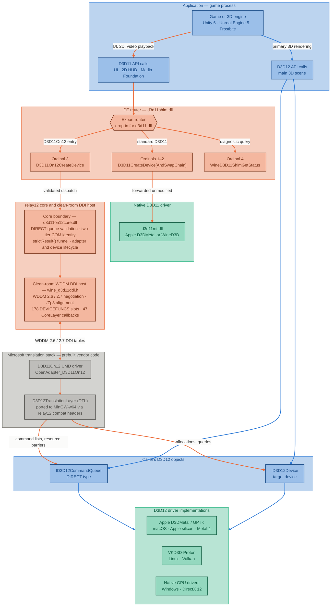

# relay12: Direct3D 11 to 12 Translation Layer & WDDM DDI Host

[](LICENSE)
[](THIRD_PARTY_NOTICES.md)
[](docs/CLEANROOM-DDI.md)
[](docs/D3D11ON12.md)
[](docs/ROADMAP.md)

`relay12` provides the host environment, validation boundary, and clean-room driver infrastructure required to execute Microsoft's open-source Direct3D 11On12 User-Mode Driver (`D3D11On12`) in Wine-based and compatible graphics environments (including macOS Apple Silicon via Apple D3DMetal/GPTK, Linux via VKD3D-Proton, and native Windows).

---

## Table of Contents

- [Executive Summary & Motivation](#executive-summary--motivation)
- [System Architecture](#system-architecture)
  - [Architecture Flowchart (Mermaid)](#architecture-flowchart-mermaid)
  - [Component Architecture Layout (Text)](#component-architecture-layout-text)
  - [End-to-End Execution Flow](#end-to-end-execution-flow)
- [Core Components](#core-components)
  - [1. PE Router (`d3d11shim.dll`)](#1-pe-router-d3d11shimdll)
  - [2. Core Validation Boundary (`d3d11on12core.dll`)](#2-core-validation-boundary-d3d11on12coredll)
  - [3. Clean-Room WDDM DDI Host (`relay12-d3d11/ddi`)](#3-clean-room-wddm-ddi-host-relay12-d3d11ddi)
  - [4. Microsoft D3D11On12 & DTL Portability](#4-microsoft-d3d11on12--dtl-portability)
- [Architectural Philosophy & Invariants](#architectural-philosophy--invariants)
- [Directory Structure](#directory-structure)
- [Verification & Safety Gates](#verification--safety-gates)
- [Building & Development](#building--development)
- [Implementation Roadmap](#implementation-roadmap)
- [Further Reading](#further-reading)
- [Licensing](#licensing)

---

## Executive Summary & Motivation

### The Hybrid Pipeline Problem

Modern games (built on engines like **Unity 6**, **Unreal Engine 5**, and **Frostbite**) frequently utilize a **hybrid rendering architecture**:
- The primary 3D rendering pipeline uses **Direct3D 12** for low-level GPU control, multi-threaded command recording, and modern ray tracing.
- Secondary subsystems—such as video cutscene playback via Windows Media Foundation (WMF), in-game HUDs, and UI layers (e.g., ImGui, CEGUI)—rely on **Direct3D 11**.

To avoid duplicating graphics contexts and GPU memory overhead, these engines call `D3D11On12CreateDevice`, passing their active `ID3D12Device` and direct `ID3D12CommandQueue`. This allows Direct3D 11 rendering commands to interoperate directly with the Direct3D 12 queue and resources.

### Why Existing Runtimes Fall Short

1. **Apple D3DMetal / GPTK:** Historically, Apple's `d3d11.dll` exported `D3D11On12CreateDevice` as a stub returning `DXGI_ERROR_UNSUPPORTED` (`0x887a0004`), causing games with hybrid rendering pipelines to crash, freeze on video playback, or display black screens.
2. **Wine Core Architecture:** Wine implements Direct3D 11 by forwarding directly to WineD3D (or DXVK). Wine does not provide the Windows Driver Model (WDDM) User-Mode Driver (UMD) host runtime required to host D3D11 user-mode driver DLLs.
3. **Microsoft D3D11On12 Is Not a Full Runtime:** Microsoft open-sourced `D3D11On12` and `D3D12TranslationLayer`, but `D3D11On12` is an internal user-mode driver (`OpenAdapter_D3D11On12`). It requires a host runtime that implements the WDDM Device Driver Interface (DDI) callback tables (`DEVICEFUNCS` and `CORELAYER_DEVICECALLBACKS`).

`relay12` bridges this gap cleanly by implementing the missing WDDM DDI host and routing layer, without copying proprietary Windows Driver Kit (WDK) headers and without requiring intrusive modifications to upstream Wine.

---

## System Architecture

### Architecture Flowchart (Mermaid)

The diagram below illustrates how Direct3D calls flow from the application through `relay12` down to underlying GPU driver backends. Two pipelines run side by side: the game's **D3D12 pipeline** (blue) reaches its driver untouched, while its **D3D11 pipeline** (orange) is routed through `relay12` and lands on the game's *own* D3D12 device and queue.



Colour is a wayfinding aid only — every box is labelled, so the diagram reads the same in greyscale or print:

| Colour | Owner | Covers |
|---|---|---|
| Blue | The game | Its API call sites and the `ID3D12Device` / `ID3D12CommandQueue` it created |
| Orange | `relay12` | `d3d11shim.dll`, `d3d11on12core.dll`, and the clean-room DDI host |
| Grey | Microsoft | Prebuilt `D3D11On12` UMD driver and `D3D12TranslationLayer` |
| Green | Driver vendors | Native D3D11 driver and the D3D12 backends `relay12` hands off to |

---

### Component Architecture Layout (Text)

For plain-text and terminal inspection, the architecture layout is presented below:

```text
+---------------------------------------------------------------------------------------+
|                                  APPLICATION (GAME)                                   |
|                     (e.g., Unity 6, Unreal Engine 5, Frostbite)                       |
+-------------------------------------------+-------------------------------------------+
                     |                                           |
                     | D3D11 API Calls                           | D3D12 API Calls
                     | (UI, 2D, Media Foundation)                | (Primary 3D Pipeline)
                     v                                           v
+-------------------------------------------+   +---------------------------------------+
|           PE ROUTER (d3d11shim.dll)       |   |                                       |
|  Exports:                                 |   |                                       |
|  - Ordinal 1: D3D11CreateDevice           |   |                                       |
|  - Ordinal 2: D3D11CreateDeviceAndSwap... |   |                                       |
|  - Ordinal 3: D3D11On12CreateDevice       |   |                                       |
|  - Ordinal 4: WineD3D11ShimGetStatus      |   |                                       |
+---------------------+---------------------+   |                                       |
       |              |                         |                                       |
       | [Ord 1 & 2]  | [Ordinal 3]             |                                       |
       | Standard     | D3D11On12               |                                       |
       | Forwarding   | Routing                 |                                       |
       v              v                         |                                       |
+--------------+ +----------------------------+ |                                       |
| NATIVE D3D11 | | CORE BOUNDARY              | |                                       |
| (d3d11mt.dll)| | (d3d11on12core.dll)        | |                                       |
| Apple D3D-   | | - Queue Type Validation    | |                                       |
| Metal D3D11  | | - Two-Tier COM Identity    | |                                       |
| or WineD3D   | | - strictResult() Funnel    | |                                       |
+--------------+ +--------------+-------------+ |                                       |
                                |               |                                       |
                                v               |                                       |
                 +----------------------------+ |                                       |
                 | CLEAN-ROOM WDDM DDI HOST   | |                                       |
                 | (wine_d3d11ddi.h)          | |                                       |
                 | - WDDM 2.6 / 2.7 Negotiator| |                                       |
                 | - DEVICEFUNCS (178 slots)  | |                                       |
                 | - Callbacks (47 slots)     | |                                       |
                 | - Natural Alignment (/Zp8) | |                                       |
                 +--------------+-------------+ |                                       |
                                |               |                                       |
                                | DDI Calls     |                                       |
                                v               |                                       |
                 +----------------------------+ |                                       |
                 | MICROSOFT D3D11ON12 UMD    | |                                       |
                 | (OpenAdapter_D3D11On12)    | |                                       |
                 +--------------+-------------+ |                                       |
                                |               |                                       |
                                v               |                                       |
                 +----------------------------+ |                                       |
                 | D3D12 TRANSLATION LAYER    | |                                       |
                 | (MinGW GCC Ported DTL)     | |                                       |
                 +--------------+-------------+ |                                       |
                                |               |                                       |
                                | D3D12 Work    | Direct D3D12 Calls                    |
                                v               v                                       |
                 +----------------------------------------------------------------------+
                 |               CALLER'S D3D12 DEVICE & COMMAND QUEUE                  |
                 |           (ID3D12Device & ID3D12CommandQueue - Direct Queue)         |
                 +----------------------------------+-----------------------------------+
                                                    |
                                                    v
                 +----------------------------------------------------------------------+
                 |                   DIRECT3D 12 HOST IMPLEMENTATIONS                   |
                 +--------------------------+--------------------+----------------------+
                 | Apple D3DMetal / GPTK    | VKD3D-Proton       | Native Windows       |
                 | (macOS / Metal 4)        | (Linux / Vulkan)   | (Hardware Drivers)   |
                 +--------------------------+--------------------+----------------------+
```

---

### End-to-End Execution Flow

1. **Initialization:** The application creates its Direct3D 12 device and direct command queue.
2. **On12 Invocation:** The application invokes `D3D11On12CreateDevice(pDevice, flags, ..., pCommandQueues, numQueues, ..., ppDevice, ppImmediateContext)`.
3. **PE Routing & Validation:** `d3d11shim.dll` intercepts the call, initializes outputs, and forwards to `d3d11on12core.dll`, which validates queue types (`DIRECT`), checks two-tier COM identity, and funnels queries through `strictResult()`.
4. **DDI Host & UMD Activation:** The clean-room DDI host negotiates WDDM 2.6/2.7 tables and invokes `OpenAdapter_D3D11On12` in Microsoft's D3D11On12 driver.
5. **Command Submission:** D3D11 rendering operations are translated by Microsoft's `D3D12TranslationLayer` directly into D3D12 command lists submitted to the application's queue.

For detailed sequence diagrams, state models, and design invariants, see [`docs/D3D11ON12.md`](docs/D3D11ON12.md).

---

## Core Components

### 1. PE Router (`relay12-d3d11/d3d11shim.cpp`)

Drop-in router for `d3d11.dll` providing exact Windows and Wine export compatibility:

| Export Ordinal | Function Name | Routing Behavior | Failure Mode |
| ---: | :--- | :--- | :--- |
| **1** | `D3D11CreateDevice` | Forwards directly to `d3d11mt.dll` | Returns `DXGI_ERROR_UNSUPPORTED` if `d3d11mt.dll` is missing |
| **2** | `D3D11CreateDeviceAndSwapChain` | Forwards directly to `d3d11mt.dll` | Returns `DXGI_ERROR_UNSUPPORTED` if `d3d11mt.dll` is missing |
| **3** | `D3D11On12CreateDevice` | Routes to `d3d11on12core.dll` | Returns `DXGI_ERROR_UNSUPPORTED`, zeroes all output pointers |
| **4** | `WineD3D11ShimGetStatus` | Queries runtime readiness flags | Returns `HRESULT` with status bitmask |

During deployment alongside native D3D11 implementations (e.g. Apple D3DMetal or WineD3D), the native library is named `d3d11mt.dll`. Ordinary D3D11 creation calls forward transparently with zero overhead.

### 2. Core Validation Boundary (`relay12-d3d11/d3d11on12core.cpp`)

Encapsulates defensive validation before translation layer state is touched:
- **Queue Type Verification:** Restricts queue usage to `D3D12_COMMAND_LIST_TYPE_DIRECT`.
- **Two-Tier COM Identity:** Verifies queue/device ownership via typed pointer comparisons first, falling back to `IUnknown` identity queries only when pointers differ.
- **The `strictResult()` Funnel:** Ensures every interface acquisition validates non-null returns on `S_OK`.
- **Versioned C ABI:** Exports stable ordinal interfaces (`WineD3D11On12CreateDeviceV1`, `WineD3D11On12OpenAdapterV1`, etc.) to isolate the router from driver internals.

### 3. Clean-Room WDDM DDI Host (`relay12-d3d11/ddi/wine_d3d11ddi.h`)

Provides clean-room authored WDDM 2.6/2.7 DDI interface declarations without proprietary Windows Driver Kit (WDK) dependencies. Natural 8-byte alignment (`/Zp8`) is strictly enforced; `#pragma pack` is prohibited.

### 4. Microsoft D3D11On12 & DTL Portability

Enables Microsoft's upstream `D3D11On12` and `D3D12TranslationLayer` (DTL) to compile cleanly under MinGW-w64 (GCC and Clang) in C++17 mode without MSVC, ATL, or ETW telemetry dependencies.

---

## Architectural Philosophy & Invariants

All contributions to `relay12` must preserve the project's non-negotiable invariants: fail-closed routing, natural 8-byte alignment, clean-room boundary isolation, strict interface acquisition, and dedicated device ownership. See [`AGENTS.md`](AGENTS.md) §2 and [`docs/D3D11ON12.md`](docs/D3D11ON12.md) §2 for the normative specifications.

---

## Directory Structure

| Path | Description |
| :--- | :--- |
| [`relay12-d3d11/`](relay12-d3d11/) | Core implementation: PE Router (`d3d11shim.cpp`), Core Boundary (`d3d11on12core.cpp`), ABI header (`wine_d3d11on12.h`), diagnostic logging (`wine_d3d11_diag.h`). |
| [`relay12-d3d11/ddi/`](relay12-d3d11/ddi/) | Clean-room WDDM DDI declarations (`wine_d3d11ddi.h`). |
| [`compat/`](compat/) | Cross-compiler portability headers (`relay_hresult_error.hpp`, `relay_atl_compat.hpp`, `relay_d3d12_struct_return.hpp`). |
| [`scripts/`](scripts/) | Static compliance audits, layout generators, and SDK overlay tooling. |
| [`tests/`](tests/) | Python CI gate test suites (`test_ci_gates.py`), mock core unit tests (`d3d11on12coretest.c`), DDI layout tests (`d3d11ddilayout.c`). |
| [`docs/`](docs/) | Comprehensive technical documentation, roadmaps, and guidelines. |
| [`third_party/`](third_party/) | Pinned submodules: `D3D11On12`, `D3D12TranslationLayer`, `DirectX-Headers`. |

---

## Verification & Safety Gates

`relay12` employs rigorous static audits and unit test harnesses executed on every change:

| Gate / Command | Description |
| :--- | :--- |
| `python3 -m unittest discover -s tests -p "test_*.py"` | Executes comprehensive CI gate unit tests (100+ tests validating all safety rules). |
| `python3 scripts/gen_ddi_layout.py --check` | Compares clean-room DDI structure layouts and field offsets against an independent layout calculation model. |
| `python3 scripts/check_ddi_header.py` | Validates documentation provenance blocks (URLs and dates) and enforces the `#pragma pack` ban. |
| `python3 scripts/check_interface_acquisition.py relay12-d3d11` | Verifies that every `QueryInterface` and `GetDevice` call routes through `strictResult()`. |
| `python3 scripts/check_pe_audit.py` | Audits compiled PE binaries to ensure zero illegal dependencies on `libstdc++` or `libgcc_s`. |
| `python3 scripts/inventory_dtl_portability.py` | Compares Microsoft DTL sources against the portability baseline (`docs/dtl-portability-baseline.json`). |

---

## Building & Development

### Prerequisites

- **CMake 3.20+**
- **Python 3.8+**
- **MinGW-w64 GCC** (or Clang targeting `x86_64-w64-mingw32`) or **MSVC 2022**

### Windows SDK Header Overlay

Building the full translation driver requires standard Direct3D headers. Because proprietary headers are not redistributed:

```bash
# Downloads pinned SDK/WDK NuGet packages, verifies SHA-256 digests, and generates temporary overlay
./scripts/prepare-windows-sdk-overlay.sh
```

### Compiling with CMake (MinGW-w64 Cross-Compilation)

```bash
mkdir build && cd build
cmake .. \
  -DCMAKE_SYSTEM_NAME=Windows \
  -DCMAKE_C_COMPILER=x86_64-w64-mingw32-gcc \
  -DCMAKE_CXX_COMPILER=x86_64-w64-mingw32-g++ \
  -DCMAKE_BUILD_TYPE=Release
cmake --build .
```

### Running Static Compliance Checks

```bash
python3 scripts/gen_ddi_layout.py --check
python3 scripts/check_ddi_header.py
python3 scripts/check_interface_acquisition.py relay12-d3d11
python3 -m unittest discover -s tests -p "test_*.py"
```

---

## Implementation Roadmap

For complete architectural scope, completed milestones, and active Phase 2 priorities, refer to [`docs/ROADMAP.md`](docs/ROADMAP.md):

- [x] **Phase 0: Safe Routing, PE Boundary & Clean-Room DDI Host** — Drop-in `d3d11shim.dll` with fail-closed semantics, ordinal routing, `/Zp8` clean-room `wine_d3d11ddi.h` headers, and strict interface acquisition.
- [x] **Phase 1: Resource Interop, UMA Telemetry & Game Startup** — Wrapped D3D12 resources (patches 0013–0026), first frame validation, UMA staging burst retention (`D3D11ON12_COMPAT_UploadBurstCacheMiB`), and live Steam-ready PEAK startup under MSYNC.
- [ ] **Phase 2: Active Priorities (TODOs)**:
  - **[P0] Device & Hybrid Swapchain Presentation Integration**: Full D3D11On12 device creation and swapchain present in hybrid engines (Unity 6).
  - **[P1] Automatic UMA Profile Qualification**: Dynamic detection and auto-promotion of Apple Silicon memory tiers ($\le 8$ GiB vs 16+ GiB).
  - **[P2] Progressive DDI Signature Promotion**: Progressive population of remaining `D3DWDDM2_6DDI_DEVICEFUNCS` slots on demand.
  - **[P2] Advanced Shader Translation & Stream-Output**: Author clean-room argument structs and emulate stream-output buffers.

---

## Further Reading

- **[docs/ROADMAP.md](docs/ROADMAP.md):** Authoritative project roadmap, active Phase 2 priorities (TODOs), and scope boundaries.
- **[docs/D3D11ON12.md](docs/D3D11ON12.md):** Complete system architecture, component boundaries, failure modes, policy, and rollout checklist.
- **[docs/UMA-MEMORY.md](docs/UMA-MEMORY.md):** UMA staging pool management, memory profiles (legacy, balanced, aggressive), and empirical telemetry.
- **[docs/CLEANROOM-DDI.md](docs/CLEANROOM-DDI.md):** Clean-room WDDM DDI authoring guidelines, version negotiation proof, and implementation worklist.
- **[docs/TESTS.md](docs/TESTS.md):** Testing architecture, concurrency testing, and mock/hardware test suites.
- **[docs/validation/README.md](docs/validation/README.md):** Historical validation archive indexing first-frame rendering, wrapped resources, and empirical investigations.
- **[AGENTS.md](AGENTS.md):** Architecture invariants, safety rules, and guidelines for automated coding agents.
- **[SKILLS.md](SKILLS.md):** Step-by-step developer runbook for layout generation, compilation, and test execution.

---

## Licensing

- **Router, Core, Tests, and Scripts:** Licensed under the [GNU General Public License v3.0](LICENSE) (`GPL-3.0-only`).
- **Submodules (`third_party/D3D11On12`, `third_party/D3D12TranslationLayer`, `third_party/DirectX-Headers`):** Licensed under the [MIT License](THIRD_PARTY_NOTICES.md).
