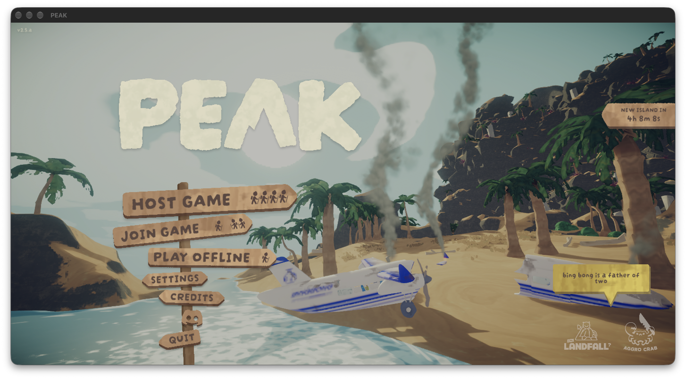

# PEAK Steam-ready startup — 2026-10-02

The marked test prefix now launches PEAK through Windows Steam with the exact
`971b374` Relay12 bundle and its matching installed runtime host. MSYNC and
explicit balanced memory policy are enabled; direct/force-coherency flags are
unset. No `steam_appid.txt` is present. The normal game bottle is untouched.

## Result

A fresh Steam login succeeds, the game's own Steam API DLL initializes, and
PEAK selects Direct3D 12 feature level 12.2 and renders its main menu in a
visible 1408×757 macOS window. The fresh Unity log contains no Steam initialization
failure, device-removal report or unhandled crash marker. The startup failure
from the preceding direct diagnostic is therefore no longer reproduced.
This is startup/menu evidence, not a gameplay or FPS comparison.

## What changed and what the probes establish

The initial follow-up found no running Windows Steam client in the marked
prefix. A locally compiled read-only diagnostic dynamically loaded PEAK's
`PEAK_Data/Plugins/x86_64/steam_api64.dll`, queried SteamAPI_IsSteamRunning,
then called SteamAPI_InitFlat with PEAK's app ID in the diagnostic environment.
The diagnostic never changes or replaces the game's Steam API DLL.

The observed progression was:

| Client state | IsSteamRunning | InitFlat result |
| --- | --- | --- |
| Absent | false | 2: NoSteamClient |
| Starting | true | 1: generic failure; `ConnectToGlobalUser failed` |
| Ready after fresh login | true | 0: success |

Steam was restarted in the same prefix/runtime/MSYNC mode as PEAK. The retained
client uses a detached process session so completion of a short diagnostic
launcher does not end its lifetime. The normal `steam.exe -applaunch 3527290
-force-d3d12` request returned zero before Steam was ready. PEAK appeared later,
after a fresh `RecvMsgClientLogOnResponse` OK event. A fixed startup delay or
successful handoff alone would have declared readiness too early in this run.

This demonstrates that app-ID injection alone is insufficient and that the
Steam client must be available and initialized. It does not establish every
internal reason for the earlier client/global-user failures or require a new
D3D12/Metal implementation change. Fresh login parsing is case-sensitive if
implemented naively: the actual marker is `RecvMsgClientLogOnResponse`, not
`LogonResponse`. The evidence extractor here accepts the observed spelling.

Valve documents the dynamic initialization entry and its result codes in its
[public Steam API declarations](https://github.com/ValveSoftware/Proton/blob/proton_11.0/lsteamclient/steamworks_sdk_164/steam_api.h).
The [Steamworks initialization documentation](https://partner.steamgames.com/doc/api/steam_api)
explains client, app-ID and user-context requirements.

## Relay12 evidence and limits

[Successful stage markers](relay12-stages.log) verify caller device/queue
validation, runtime host creation and driver OpenAdapter/CreateDevice.
CreateDevice reports the non-failing HRESULT `0x087a0004`; host creation
returns `0x00000000`. A separate Windows module snapshot confirms the staged
router/core/driver/host, D3D12/D3DMetal/DXGI, Steam API and steamclient DLLs are
loaded. Staged DLL hashes and safe state fields are in [result.json](result.json).

No wrapped-resource stage or unsupported-operation warning was observed. Metal
HUD logging was disabled for this startup check, so there are no comparable
frame-time samples. The menu screenshot shows actual rendering; it does not
qualify the existing wrapped-resource/HUD smoke gate. PEAK's native D3D12 renderer
continues to own ordinary game rendering; loaded Relay12 DLLs and successful
On12 device creation do not prove its UMA upload pool is exercised by gameplay.

Targeted attempts to select PLAY OFFLINE did not leave the menu. Wine input
helpers could not acquire PEAK's foreground window; the native per-process click
also produced no scene transition. A global input click was withheld when its
foreground check did not identify PEAK. The test Steam client and game are left
running for manual offline entry. No gameplay acceptance is claimed.

Raw Steam/Wine/Unity logs and API diagnostics remain in the private sibling
workspace; account identifiers and authentication data are not published.
Next: enter offline gameplay, capture a repeatable route under matched legacy
and balanced builds, and require positive wrapped/upload telemetry before
attributing any game-time difference to Relay12's staging policy.
